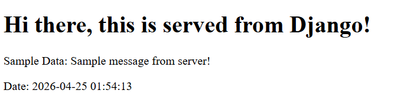

# Django Templates Demo
Django built-in backend template server.

## Preview


## Setup
1. Clone this repository by running `git clone https://github.com/khianvictorycalderon/django-templates-demo.git`
2. Generate a safe key using this command in your python interpreter or cmd:
    ```python
    from django.core.management.utils import get_random_secret_key
    print(get_random_secret_key())
    ```
3. Create an `.env` file that contains (paste the generated key in `DJANGO_SECRET_KEY`):
    ```env
    DJANGO_ENV=development
    DJANGO_SECRET_KEY=your-key-here
    DEBUG=True
    ALLOWED_HOSTS=127.0.0.1, localhost, apixer.vercel.app
    ```
    Change the allowed credentials depending on where you want your project to be tested.
4. Run the following command for database migration:
    - `python manage.py makemigrations` or `py manage.py makemigrations`
    - `python manage.py migrate` or `py manage.py migrate`
5. To run the server, run `py manage.py runserver` or `python manage.py runserver`
    NOTE: If you encounter `Error: You don't have permission to access that port.`, just use a different port, for example:
    - `py manage.py runserver 7000`
    - `python manage.py runserver 7000`
    Change the 7000 if the port is used.
6. To create another app, just run `python manage.py startapp <app-name>` or `py manage.py startapp <app-name>`, example: `py manage.py startapp myapp`

## Prerequisites:
Install the following first (globally) if you haven't installed it yet:
- `pip install django`